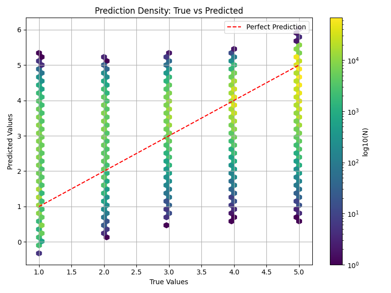
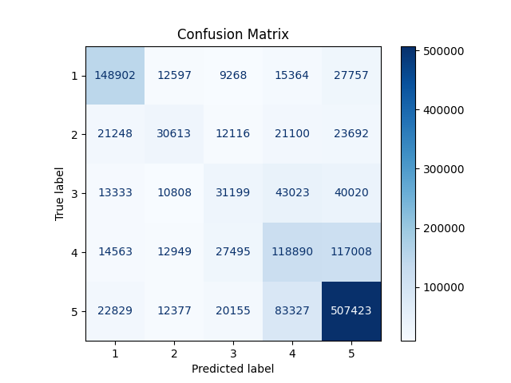

# Personalized Restaurant Recommendation System

#### Originally developed in part for final project in SML312: Independent Projects in Data Science taught by Professor Jonathan Hanke at Princeton University. 

### Overview
The recommendations are made with two main objectives identified below:

1. Given a user, identifying which other user in the database has the most similar taste preferences.

2. Given a restaurant and a user, predicting what rating the user will give that restaurant from 1-5.

At the end of the day, this goal models *very similar* to collaborative filtering algorithms, made specific to food preference domain with online reviews data.

I utilize a number of data science modeling methods (e.g. KNN, Multivariate Regression with Ridge and Lasso Regularization, Random Forest Classification) as well as a scaled cosine similarity-based static recommendation system.

$$
\textit{scaled cos sim} = \textit{cos sim} \times \frac{\min(|a|, |b|)}{\max(|a|, |b|)}
$$

### iOS Application
A simple Flask server is used to power an iOS application to provide restaurant recommendations for Yelp users.
- Also enables optional location & cuisine filtering to satisfy any cravings in your area!

*Demo Screen:*

Please find more about the app at [Restaurant Repo](https://github.com/smkim0508/RestaurantRepo).

### Dataset
I experimented & developed the algorithm using the [Yelp Business Reviews Dataset](https://www.kaggle.com/datasets/yelp-dataset/yelp-dataset?select=yelp_academic_dataset_business.json), found on Kaggle.

This dataset has approximately 7M restaurant reviews across 2M users and 150K businesses.

### Experimental Results
Some training and evaluation examples are shown below:

- Heatmap Prediction

- RF Prediction

